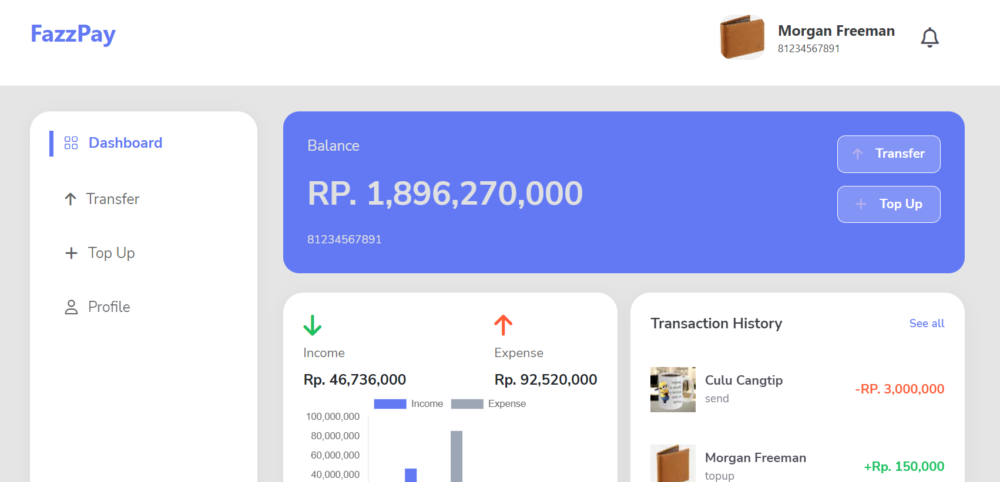

# Zwallet: Money Transfer App With NextJS

<div align="center">
	

[](https://www.npmjs.com/package/react-router-dom)
[](https://www.npmjs.com/package/axios)
[](https://www.npmjs.com/package/chart.js)
[](https://www.npmjs.com/package/craco)
[](https://www.npmjs.com/package/redux)
[](https://www.npmjs.com/package/bootstrap)
[](https://www.npmjs.com/package/react-toastify)

<br/>

</div>
Fazzpay is a E-Wallet app that can make it easier for customer to transfer their money. Customer can simply register, login, transfer or top up their money and see their transaction history. they also can see and edit their profile

## Contents

- [Features](#features)
- [Run Application](#how-to-run-the-application)
- [Deployment](#deployment)
- [Screenshots](#screenshots)
- [Related Projects](#related-projects)
- [Contributors](#contributors)

## Features

### Public

- Login
- Register
- Forgot Password
- Transfer
- Transfer History
- Edit profile
- Dashboard

## How to Run the Application

### 1. Clone this repository

Clone this repository by run the following code:

```
$ git clone <this-repo-url>
```

### 2. Install dependency packages

Install dependency packages by run the following code inside project folder:

```
$ npm install
```

### 3. Configure .env file

Configure .env file by create file named .env inside project folder and add this line to the file:

```
NEXT_PUBLIC_BACKEND_URL = https://fazzpay-rose.vercel.app
```

### 4. Run projects

Run this projects by run the following code:

```
$ npm run dev
```

It runs the app in the development mode.\
Open [http://localhost:3000](http://localhost:3000) to view it in your browser.

The page will reload when you make changes.\
You may also see any lint errors in the console.

## Deployment

[Vercel deploy link](https://fazzpay-seven.vercel.app/) 

## Screenshots

<div align="center">



</div>
